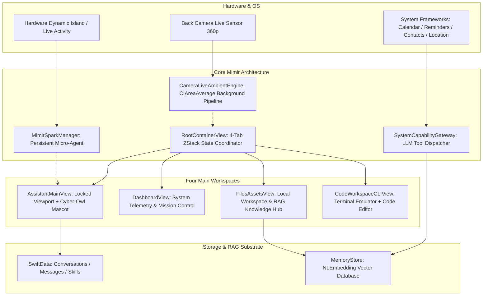

# Mimir iOS — Comprehensive Project Handover Document (`PROJECT_HANDOVER.md`)

> **Document Status**: Production-Grade Systems Handover  
> **Author**: Lead Systems Architect  
> **Target Audience**: Successor AI Agents & Engineering Team  
> **Target Release**: Mimir iOS (iOS 26.0+, Xcode 26, Swift 6.0 Complete Concurrency)  
> **Repository**: [https://github.com/zxl1828/mimir-ios](https://github.com/zxl1828/mimir-ios)  
> **License**: MIT + Commons Clause (Free to use, modify, distribute; commercial resale strictly prohibited)

---

## Executive Summary

**Mimir** is a high-craft, native iOS AI assistant engineered with an uncompromising commitment to local-first privacy, fluid haptics, and the iOS 26 Liquid Glass visual design system. The application operates across four cohesive workspaces (AI Assistant, Dashboard, Files & Assets Hub, and Code Workspace CLI), tied together by an in-memory state coordination engine, persistent hardware Dynamic Island presence (**Gemini Spark** paradigm), and an extensible on-device RAG memory substrate.

This document serves as the **authoritative architectural contract and operational handbook** for the incoming successor AI. All design tokens, lifecycle invariants, resolved defects, and engineering guardrails documented herein are strictly binding.

---

## Table of Contents
1. [Section 1: Project Overview & Technology Stack](#section-1-project-overview--technology-stack)
2. [Section 2: Core Architecture & Non-Negotiable Engineering Rules](#section-2-core-architecture--non-negotiable-engineering-rules)
3. [Section 3: Audit History & Recently Resolved Defects](#section-3-audit-history--recently-resolved-defects)
4. [Section 4: Navigation, Layout & Multi-Workspace Module Topology](#section-4-navigation-layout--multi-workspace-module-topology)
5. [Section 5: Motion Engine, Visual Design Tokens & Performance Guidelines](#section-5-motion-engine-visual-design-tokens--performance-guidelines)
6. [Section 6: Pending Tasks, Roadmap & Successor Engineering Directives](#section-6-pending-tasks-roadmap--successor-engineering-directives)

---

## Section 1: Project Overview & Technology Stack

### 1.1 Project Identity & Core Capabilities
Mimir bridges high-performance generative model inference with deep on-device Apple platform integration:
* **Multi-Provider LLM Gateway**: Native streaming support for DeepSeek (V3 & R1 Reasoner), OpenAI-compatible gateways, and Anthropic Claude endpoints, resolved dynamically by API key prefix or user selection.
* **Autonomous System Capabilities**: Low-latency hardware tools via [`SystemCapabilityGateway`](file:///C:/Users/admin/Documents/Codex/2026-09-18/markdown-ios-26-deepseek-github-actions/Mimir/Services/SystemTools/SystemCapabilityGateway.swift) spanning Calendar, Reminders, Contacts, CoreLocation, Apple Music, MapKit POI, Filesystem Export, and On-Device Workspace File Editing.
* **Local-First Privacy & Memory**: Zero-cloud vector storage using `NLEmbedding` and `Accelerate.vecLib`, indexed in-memory with sub-millisecond retrieval latency.
* **Multi-Modal Workspaces**: Integrated document scanner, Vision OCR, barcode decoding, Spotlight indexing, and local file management.

### 1.2 Technology Stack Matrix

| Subsystem | Specification / Framework | Implementation Notes |
| :--- | :--- | :--- |
| **Language & Toolchain** | Swift 6.0 (`SWIFT_STRICT_CONCURRENCY: complete`), Xcode 26 | Fully strictly concurrent: `@Sendable`, actors, `@MainActor`, and data-race isolation enforced. |
| **Declarative UI** | SwiftUI (iOS 26 Native Liquid Glass) | Pure SwiftUI hierarchy; UIKit bridged only for `UIImpactFeedbackGenerator` and `UIActivityViewController`. |
| **Project Generation** | XcodeGen (`Project.yml`) | Declarative `.xcodeproj` generation; source of truth for build settings, bundles, and capabilities. |
| **Data Persistence** | SwiftData (`ModelContainer`, `ModelContext`) | Stores `Conversation`, `Message`, `Skill`, `AgentDockItem`, and `ScheduledTask`. |
| **Live Hardware Presence** | `ActivityKit` (Dynamic Island & Lock Screen HUD) | Persistent micro-agent lifecycle (`staleDate: nil`), managed by [`MimirSparkManager`](file:///C:/Users/admin/Documents/Codex/2026-09-18/markdown-ios-26-deepseek-github-actions/Mimir/Services/LiveActivity/MimirSparkManager.swift). |
| **Sensory & Audio** | `AVFoundation` (`AVSpeechSynthesizer`, `AVAudioEngine`) | Voice activity detection (VAD), offline system speech synthesis, and live camera ambient capture. |
| **Platform Frameworks** | `WeatherKit`, `EventKit`, `Contacts`, `CoreLocation`, `MusicKit`, `MapKit` | Wrapped in fail-soft system capability dispatchers with localized permission degradation. |
| **External Protocol** | Model Context Protocol (`modelcontextprotocol/swift-sdk` 0.11.0) | Standardized MCP client over HTTP/SSE supporting tool loopbacks, approval flows, and dynamic registration. |
| **CI/CD & Delivery** | GitHub Actions (`macos-15`), `scripts/package_ipa.sh` | Automated clean-room unsigned IPA generation compliant with third-party iOS signers (Bullfrog, Scarlet, ESign). |

---

## Section 2: Core Architecture & Non-Negotiable Engineering Rules



### 2.1 The "Gemini Spark" Micro-Agent Paradigm
* **Persistent Island Residency**: Mimir does not terminate its Dynamic Island activity when a turn ends. [`MimirSparkManager`](file:///C:/Users/admin/Documents/Codex/2026-09-18/markdown-ios-26-deepseek-github-actions/Mimir/Services/LiveActivity/MimirSparkManager.swift) requests a resident Live Activity at app launch with `staleDate: nil`, ensuring the micro-agent stays resident across backgrounding and device locking.
* **Expanded Liquid Glass HUD**: When expanded, the Dynamic Island renders an ultra-thin glass overlay featuring:
  - Contextual snapshot: live weather icon, localized temperature, and next calendar event.
  - Typewriter preview: concise 2–4 line live streaming text of assistant thoughts or responses.
  - Interactive Action Gateway: tapping invokes custom URL scheme `mimir://` to route directly into the Assistant home view and focus the input bar.
* **Lifecycle State Machine**: Transitions through `idle` ➔ `listening` ➔ `thinking` ➔ `streaming` ➔ `completed` ➔ `failed`.

### 2.2 Locked Assistant Viewport (No Root ScrollView)
* **The Non-Scrollable Directive**: The root viewport of [`AssistantMainView`](file:///C:/Users/admin/Documents/Codex/2026-09-18/markdown-ios-26-deepseek-github-actions/Mimir/Views/AssistantMainView.swift) must **strictly remain non-scrollable**. Wrapping the top-level view in a vertical `ScrollView` is strictly forbidden.
* **Adaptive Vertical Budgeting**: Layout geometry is partitioned using adaptive `Spacer(minLength: ...)` to guarantee zero element occlusion and zero text clipping across screen heights ranging from iPhone 14/15/16 (844pt) up to Pro Max (932pt).
* **Keyboard Inset Avoidance**: The bottom input dock is pinned via safe-area geometry. When the keyboard triggers `UIResponder.keyboardWillShowNotification`, the floating tab bar sinks 100pt along the Y-axis and fades to opacity 0, while the input bar elevates naturally without causing content overlap.

### 2.3 Native Liquid Glass Material System
* **Refraction & Specular Caustics**: All primary cards, chips, and bars must use iOS 26 `.liquidGlass(.regular, in: ...)` combined with a 1pt dual-gradient refraction border ([`AppUI.refractionEdge(_:scheme:)`](file:///C:/Users/admin/Documents/Codex/2026-09-18/markdown-ios-26-deepseek-github-actions/Mimir/Theme/SystemUI.swift#L173-L191)).
* **Specular Gradient Geometry**:
  - *Leading/Top Edge (Incident Light)*: Translucent specular white (`Color.white.opacity(scheme == .dark ? 0.60 : 0.90)`).
  - *Trailing/Bottom Edge (Subsurface Refraction)*: Theme-tinted glow (`accent.opacity(scheme == .dark ? 0.50 : 0.40)`).
* **Legibility Scrim**: Every glass container must layer a high-contrast backing fill beneath the glass layer to ensure WCAG AAA text contrast across arbitrary backgrounds.

### 2.4 Strict Color Base Decoupling (Zero Pure Black)
* **The Absolute Rule**: Pure black (`Color.black`, `UIColor.black`), muddy dark gray overlays, and uncalibrated system dark materials are **strictly forbidden** in both Light and Dark modes.
* **Light Mode Baseline**:
  - Canvas & View Backgrounds: Pure white (`#FFFFFF`) or ultra-light lavender purple (`#F8F6FD`).
  - Press Sheen & Glare: Soft lavender-violet (`#EADEFA.opacity(0.35)`) combined with a pure white specular highlight. No dirty graying or darkening under finger pressure.
* **Dark Mode Baseline**:
  - Canvas & View Backgrounds: Deep luxury plum purple (`#120D1D`) and dark plum violet (`#1A122B`).
  - Press Sheen & Glare: Theme-tinted violet luminescence (`accent.opacity(0.25)`).

### 2.5 Dual-Engine Ambient Background Pipeline
* **Mode A (Synthetic Mesh Breathing)**: Rendered via [`AppBackgroundView`](file:///C:/Users/admin/Documents/Codex/2026-09-18/markdown-ios-26-deepseek-github-actions/Mimir/Theme/SystemUI.swift#L324-L352) with an ultra-slow, GPU-composited radial mesh gradient.
* **Mode B (Camera Live Ambient Feed)**: Executed by [`CameraLiveAmbientEngine`](file:///C:/Users/admin/Documents/Codex/2026-09-18/markdown-ios-26-deepseek-github-actions/Mimir/Services/CameraLiveAmbientEngine.swift).
  - Hardware camera video frames captured at 15/24 fps @ 360p/480p on an isolated GCD `sessionQueue`.
  - Privacy & battery rule: Downsampled strictly using GPU `CIAreaAverage` on the background queue to derive macroscopic ambient temperature (top & bottom halves).
  - Main thread protection: Color updates are throttled (dispatched only when $\Delta > 0.025$ or elapsed time $> 320\text{ms}$) and smoothed via `withAnimation(.easeInOut(duration: 0.35))`.

### 2.6 On-Device RAG Protection (Zero-Tampering Rule)
* **Invariant Vector Substrate**: The vector database and semantic indexing pipeline ([`MemoryStore`](file:///C:/Users/admin/Documents/Codex/2026-09-18/markdown-ios-26-deepseek-github-actions/Mimir/Services/Memory/MemoryStore.swift)) must remain strictly untouched.
* **Ingestion Invariant**: All contextual data extracted from external system frameworks (weather forecasts, calendar summaries, IMAP email headers, web scrape results) must pipe directly into `MemoryStore.shared.upsert(entry:context:)`.

---

## Section 3: Audit History & Recently Resolved Defects

The following critical architectural defects and production bugs were diagnosed, isolated, and permanently resolved:

### 3.1 IPA Packaging Rejection by On-Device Signing Utilities
* **Defect Phenomenon**: On-device IPA signing apps (ESign, Bullfrog Assistant, Scarlet, GBox) aborted import with: `导入失败：导入的 ipa 文件有错误，导入失败！`.
* **Root Cause Diagnosis**: Prior CI pipelines executed an ad-hoc signing step (`codesign --sign -`). This created an incomplete signature state: the app bundle contained `_CodeSignature/CodeResources`, but lacked valid certificate manifests, while the Mach-O binary had the `LC_CODE_SIGNATURE` load command injected. On-device signers parsed the IPA as a corrupt signed binary.
* **Permanent Fix**:
  - Implemented [`scripts/package_ipa.sh`](file:///C:/Users/admin/Documents/Codex/2026-09-18/markdown-ios-26-deepseek-github-actions/scripts/package_ipa.sh) to produce a **strictly unsigned, clean bundle**.
  - Script purges all `_CodeSignature` directories and invokes `codesign --remove-signature` on the binary and embedded extensions.
  - Enforced single-layer `Payload/` hierarchy, stripped `.DS_Store` and `__MACOSX`, preserved framework symlinks via `zip -r -y -X`, validated `CFBundleSupportedPlatforms == iPhoneOS`, and verified arm64 Mach-O architecture.

### 3.2 3D Card Tilt Clipping, Rim Extrusion & Optical Sink
* **Defect Phenomenon**: In [`AssistantMainView`](file:///C:/Users/admin/Documents/Codex/2026-09-18/markdown-ios-26-deepseek-github-actions/Mimir/Views/AssistantMainView.swift), touching or tilting the central card caused background purple colors to bleed out of the rounded corners, creating square jagged edges on the right and bottom sides.
* **Root Cause Diagnosis**:
  - Modifier chaining was out of order: `.clipShape()` was evaluated before external overlays and gradients.
  - The legacy `TiltGlareCardModifier` contained an ambient backlight shelf (`.blur(26) + .padding(-8)`) that extruded beyond the card boundaries during perspective rotation.
* **Permanent Fix**:
  - Rebuilt the central card into a dedicated subview [`CentralAssistantCard`](file:///C:/Users/admin/Documents/Codex/2026-09-18/markdown-ios-26-deepseek-github-actions/Mimir/Views/AssistantMainView.swift#L955-L1084) enforcing the strict modifier order:
    $$\text{Base Layer} \longrightarrow \text{Liquid Glass} \longrightarrow \text{Border Overlay} \longrightarrow \mathbf{.clipShape(RoundedRectangle(32))} \longrightarrow \mathbf{.shadow} \longrightarrow \mathbf{.compositingGroup()} \longrightarrow \mathbf{.rotation3DEffect}$$
  - Deleted the extruded backlight shelf and replaced vertical bounce with an in-place optical sink: `.scaleEffect(0.985, anchor: .center)`.

### 3.3 Root-Cause Eradication of iOS 26 Interactive Glass Darkening (`.interactive()`)
* **Defect Phenomenon**: The reasoning effort slider and glass cards turned into muddy black/dark-gray slabs when pressed by the user in Light Mode.
* **Root Cause Diagnosis**: In iOS 26, calling `.liquidGlass(.interactive())` instructs the system compositor to apply an automatic dark selection scrim on touch down. Across the project, 37 separate views were inadvertently using `.interactive()`.
* **Permanent Fix**:
  - Globally eliminated all 37 occurrences of `.interactive()` across 14 files, reverting to pure static `.liquidGlass(.regular)`.
  - Re-implemented press feedback using self-drawn highlights: custom `scaleEffect(0.985)` with spring physics, pure white/lavender tinting, and dynamic stroke border highlights.

### 3.4 Performance Bottleneck Elimination & Gesture State Isolation
* **Defect Phenomenon**: Severe UI stutter, high battery consumption, and dropped frames during continuous touch gestures.
* **Root Cause Diagnosis**:
  - `CameraLiveAmbientEngine` applied `CIGaussianBlur(radius: 110)` on every frame, starving the GPU and CPU.
  - The central card's touch drag gesture modified parent `@State` variables in `AssistantMainView`, causing the entire view hierarchy and all sub-views to re-evaluate their `body` property at 60–120Hz.
* **Permanent Fix**:
  - Switched `CameraLiveAmbientEngine` to hardware-accelerated `CIAreaAverage` downsampling on the private `sessionQueue`, adding a change gate ($\Delta > 0.025$) and 320ms throttle.
  - Isolated `pitch`, `roll`, and `isTouching` as private `@State` inside [`CentralAssistantCard`](file:///C:/Users/admin/Documents/Codex/2026-09-18/markdown-ios-26-deepseek-github-actions/Mimir/Views/AssistantMainView.swift#L955-L1084), restricting gesture changes to the card's local transformation matrix.
  - Added `.compositingGroup()` before 3D transforms to rasterize the card into a single GPU texture layer.

### 3.5 Top Scrim Occlusion & Redundancy Cleanup
* **Defect Phenomenon**: Top header items (weather capsule, settings button) were washed out by a massive top blur; decorative non-functional mockups cluttered the Dashboard.
* **Permanent Fix**:
  - Capped top variable blur height from 110pt down to 48pt, confining the blur strictly to the status bar zone.
  - Deleted non-functional mockup components (`artworkShowcaseCard`, `CosmicTreeArtworkView`).
  - Added `@Environment(\.appAccent)` to [`ExportConversationSheet`](file:///C:/Users/admin/Documents/Codex/2026-09-18/markdown-ios-26-deepseek-github-actions/Mimir/Views/ExportConversationSheet.swift) to ensure compile-time clean builds.
  - Enhanced Code Workspace CLI with local file persistence via [`WorkspaceManager`](file:///C:/Users/admin/Documents/Codex/2026-09-18/markdown-ios-26-deepseek-github-actions/Mimir/Services/Workspace/WorkspaceManager.swift) and real LLM tools (`system_workspace_list`, `_read`, `_write`).

---

## Section 4: Navigation, Layout & Multi-Workspace Module Topology

Mimir organises its entire application experience into a unified, four-workspace ZStack managed by [`RootContainerView`](file:///C:/Users/admin/Documents/Codex/2026-09-18/markdown-ios-26-deepseek-github-actions/Mimir/Views/RootContainerView.swift) and [`TabNavigationCoordinator`](file:///C:/Users/admin/Documents/Codex/2026-09-18/markdown-ios-26-deepseek-github-actions/Mimir/Navigation/TabNavigationCoordinator.swift):

```
RootContainerView
│
├── Persistent In-Memory Workspace Stack (ZStack)
│   ├── Tab 1: AI Assistant (AssistantMainView)
│   ├── Tab 2: Dashboard & Telemetry (DashboardView)
│   ├── Tab 3: Files & Assets Hub (FilesAssetsView)
│   └── Tab 4: Code Workspace CLI (CodeWorkspaceCLIView)
│
└── Suspended Floating Tab Bar (FloatingTabBar)
    └── Offsets: y = 100pt, opacity = 0 on keyboard presentation
```

### 4.1 Tab 1: AI Assistant (`AssistantMainView`)
* **Role**: Primary conversational surface and reasoning engine.
* **Sub-Components**:
  1. *Top Navigation Bar*: Greeting, localized weather pill, telemetry inspector icon, and settings trigger.
  2. *Central Assistant Card ([`CentralAssistantCard`](file:///C:/Users/admin/Documents/Codex/2026-09-18/markdown-ios-26-deepseek-github-actions/Mimir/Views/AssistantMainView.swift#L955-L1084))*: Houses the holographic Cyber-Owl mascot ([`MimirMascot`](file:///C:/Users/admin/Documents/Codex/2026-09-18/markdown-ios-26-deepseek-github-actions/Mimir/Views/Components/MimirMascot.swift)), greeting title, subtitle, and 3D parallax tilt response.
  3. *Reasoning Effort Selector*: Floating liquid glass card featuring discrete detents:
     - `High` (Thinking)
     - `X-High` (Expert)
     - `Ultra` (Max Deep-Reasoning with exclusive electric particles)
  4. *Omni Input Bar ([`MessageInputBar`](file:///C:/Users/admin/Documents/Codex/2026-09-18/markdown-ios-26-deepseek-github-actions/Mimir/Views/Components/MessageInputBar.swift))*: Capsule layout housing the attachment popover, skill slash-command dispatcher, voice mode trigger, and send/stop control.

### 4.2 Tab 2: Dashboard & Telemetry (`DashboardView`)
* **Role**: Mission control, active agent monitoring, and system telemetry.
* **Capabilities**:
  - Live tool execution auditing powered by [`ToolCallTelemetry`](file:///C:/Users/admin/Documents/Codex/2026-09-18/markdown-ios-26-deepseek-github-actions/Mimir/Services/SystemTools/ToolCallTelemetry.swift).
  - Conversation retention policy inspector and manual trigger.
  - Background task scheduling manager and automated daily brief setup.
  - RAG vector database status and memory entry browser.

### 4.3 Tab 3: Files & Assets Hub (`FilesAssetsView`)
* **Role**: Knowledge asset repository, document scanner, and export staging ground.
* **Capabilities**:
  - Local workspace folder attachment and document browsing.
  - Multi-modal asset previews (images, PDF documents, Markdown, plain text).
  - Floating Action Button (FAB) menu for importing documents, capturing camera photos, and initiating system scans.
  - Direct contextual injection: "Send to Active Conversation Context" button piping selected files into prompt attachments.

### 4.4 Tab 4: Code Workspace CLI (`CodeWorkspaceCLIView`)
* **Role**: Split-screen developer workshop and execution terminal.
* **Layout**:
  - *Top Terminal Viewport*: macOS-inspired three-dot terminal header, SF Mono streaming output, and command execution log.
  - *Local Workspace File Integration*: Directly bound to [`WorkspaceManager`](file:///C:/Users/admin/Documents/Codex/2026-09-18/markdown-ios-26-deepseek-github-actions/Mimir/Services/Workspace/WorkspaceManager.swift), allowing the assistant to read, list, and write code files on the iOS device via system tools.
  - *Bottom Collaborative Stream*: Interactive turn stream with `/run` command shortcuts and real-time output synchronization.

---

## Section 5: Motion Engine, Visual Design Tokens & Performance Guidelines

### 5.1 The Six Physical Micro-Interaction Engines
Every motion interaction in Mimir must strictly map to one of the six physical engines implemented in [`FluidInteractions.swift`](file:///C:/Users/admin/Documents/Codex/2026-09-18/markdown-ios-26-deepseek-github-actions/Mimir/Theme/FluidInteractions.swift) and [`MimirMotionEngine.swift`](file:///C:/Users/admin/Documents/Codex/2026-09-18/markdown-ios-26-deepseek-github-actions/Mimir/Theme/MimirMotionEngine.swift):

```
1. Stagger Cascade        ──> delay = Double(index) * 0.08s | offset(y: 28 -> 0) | spring(0.38, 0.76)
2. Magnetic Snap Slider   ──> Discrete detents (0.20, 0.62, 1.0) | .sensoryFeedback(.selection)
3. Micro-Sheen Highlight  ──> 1pt dual-gradient refraction border | dynamic theme tinting
4. Elastic Touch Feedback ──> In-place optical sink: scaleEffect(0.985) | UIImpactFeedbackGenerator
5. Directional Tilt       ──> Local pitch/roll | rotation3DEffect(perspective: 0.50) | .compositingGroup()
6. Velocity Snap Drawer   ──> Logarithmic rubber-band: over / (over * 0.006 + 1.0) | velocity-based snap
```

1. **Stagger Cascade**: Sequential entrance animation for lists and grid items.
   - Delay: `delay = Double(index) * 0.08`
   - Initial state: `offset(y: 28)`, `opacity: 0.0`, `scaleEffect(0.95)`
   - Spring: `.spring(response: 0.38, dampingFraction: 0.76)`
2. **Magnetic Snap Slider**: Used by the Reasoning Slider and Model Switcher.
   - Snaps to discrete step anchors with haptic confirmation (`.sensoryFeedback(.selection)`).
3. **Micro-Sheen Highlight**: Refraction edges with animated or incident light gradients, dynamically adapting to light/dark color schemes.
4. **Elastic Touch Feedback**: Standardized tap/press deformation replacing high-frequency bounce.
   - Card sink: `scaleEffect(0.985, anchor: .center)`
   - Response: `.spring(response: 0.22, dampingFraction: 0.75)`
5. **Directional Parallax Tilt**: Touch-tracked 3D card tilt confined strictly within $\pm 7.5^\circ$ with localized state storage.
6. **Velocity Snapping Drawer**: Bottom sheets implementing Apple's logarithmic rubber-banding formula:
   $$\text{effectiveHeight} = \text{maxHeight} + \left(1.0 - \frac{1.0}{\text{over} \times 0.006 + 1.0}\right) \times 64.0$$

### 5.2 Color Tokens & System Ramps

```swift
// MARK: - Mimir Color Baseline (SystemUI.swift)
public enum AppUI {
    // Pure Baselines (Zero Pure Black)
    public static let baseLightWhite     = Color.white
    public static let baseLightLavender  = Color(hex: "F8F6FD")
    public static let baseDarkDeepPurple = Color(hex: "120D1D")
    public static let baseDarkPlum       = Color(hex: "1A122B")
    public static let pressSheenLight    = Color(hex: "EADEFA")

    // Dynamic Adaptive Canvases
    public static var canvas: Color {
        Color.adaptive(light: UIColor(red: 0.973, green: 0.965, blue: 0.992, alpha: 1.0),
                       dark:  UIColor(red: 0.071, green: 0.051, blue: 0.114, alpha: 1.0))
    }
    public static var groupCanvas: Color {
        Color.adaptive(light: UIColor.white,
                       dark:  UIColor(red: 0.102, green: 0.071, blue: 0.169, alpha: 1.0))
    }
}
```

### 5.3 Non-Negotiable Performance Golden Rules
1. **Rule 1: Always apply `.compositingGroup()` before 3D transforms**: Calling `.rotation3DEffect()` on views with multiple translucent layers without `.compositingGroup()` forces GPU offscreen frame reallocation every frame.
2. **Rule 2: Never run continuous `TimelineView`s on the main thread**: Ambient breathing gradients must use native declarative spring/ease animations or static throttled timers.
3. **Rule 3: Cap dynamic blur radius at 30pt**: Never apply real-time SwiftUI `.blur(radius: > 30)` to dynamically moving content.
4. **Rule 4: Isolate gesture coordinates**: Drag gestures must always update local subview `@State`, never hoisting coordinates into screen-level container models.
5. **Rule 5: Zero `.interactive()` on Liquid Glass**: Use static `.liquidGlass(.regular)` and supply touch state feedback via custom highlights.

---

## Section 6: Pending Tasks, Roadmap & Successor Engineering Directives

### 6.1 Engineering Directives for Successor AI
* **Rule of Non-Destruction**: Do not refactor existing data models or delete established services without explicit verification.
* **Keep Concurrency Clean**: Swift 6 strict concurrency is enabled across all targets. All background callbacks must explicitly isolate to `@MainActor` or be marked `nonisolated`.
* **Zero Shell Degradation**: Do not introduce generic tab bars, standard action sheets, or non-glass navigation containers.

### 6.2 Pending Backlog & Roadmap

| Priority | Task Description | Target File / Module | Technical Guidance |
| :---: | :--- | :--- | :--- |
| **P1** | **AlarmKit Entitlement Evaluation** | [`SystemCapabilityGateway.swift`](file:///C:/Users/admin/Documents/Codex/2026-09-18/markdown-ios-26-deepseek-github-actions/Mimir/Services/SystemTools/SystemCapabilityGateway.swift) | iOS currently lacks public creation APIs for Clock alarms without private entitlements. Evaluate `AlarmKit` readiness on iOS 26 or maintain system Reminder fallback with high-priority audio alerts. |
| **P1** | **Offline KaTeX & Mermaid Bundler** | [`MarkdownText.swift`](file:///C:/Users/admin/Documents/Codex/2026-09-18/markdown-ios-26-deepseek-github-actions/Mimir/Views/Components/MarkdownText.swift) | Math formulas and diagrams currently fallback to raw text if disconnected from CDN. Pre-bundle minimal KaTeX JS and Mermaid JS assets into `Resources/Vendor` for 100% offline rendering. |
| **P2** | **MCP `ui://` Interactive Form Renderer** | [`MCPClientManager.swift`](file:///C:/Users/admin/Documents/Codex/2026-09-18/markdown-ios-26-deepseek-github-actions/Mimir/Services/MCP/MCPClientManager.swift) | Implement native Liquid Glass form generators for tools exposing dynamic JSONSchema UI requests via the `ui://` custom scheme. |
| **P2** | **Local Memory Clustering & Compaction** | [`MemoryStore.swift`](file:///C:/Users/admin/Documents/Codex/2026-09-18/markdown-ios-26-deepseek-github-actions/Mimir/Services/Memory/MemoryStore.swift) | Implement periodic background embedding compaction using Accelerate k-means clustering to merge duplicate semantic facts. |

### 6.3 Operational Playbook & Build Verification

#### 1. Local Project Generation & Validation
```bash
# Generate the Xcode project from Project.yml
xcodegen generate

# Perform command-line compile check without codesigning
xcodebuild \
  -project Mimir.xcodeproj \
  -scheme Mimir \
  -configuration Release \
  -sdk iphoneos \
  -destination 'generic/platform=iOS' \
  CODE_SIGNING_ALLOWED=NO \
  CODE_SIGNING_REQUIRED=NO \
  build
```

#### 2. Clean Packaging (On-Device Signer Ready)
```bash
# Execute canonical packaging script
bash scripts/package_ipa.sh Build/Build/Products/Release-iphoneos/Mimir.app Mimir-unsigned.ipa
```

#### 3. Git Push SSL Resolution (Windows / Proxy Workaround)
If `git push` encounters `schannel: failed to receive handshake, SSL/TLS connection failed`:
```bash
git -c http.sslBackend=openssl push origin main
```

#### 4. GitHub Actions CI Monitoring
```bash
# Inspect the 3 most recent CI runs
gh run list -L 3

# Watch active run until termination
gh run watch <run-id> --exit-status
```

---

> **End of Handover Contract**: Maintain the craft, preserve the performance, and keep Mimir refined.
