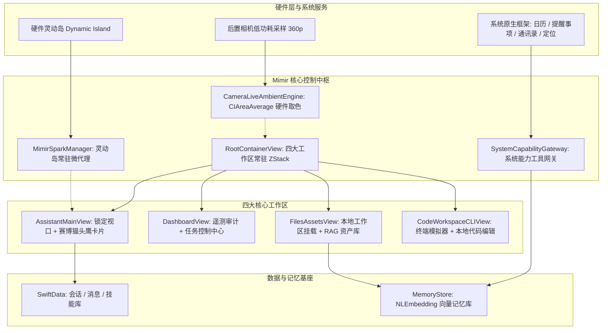

# Mimir iOS — 项目综合交接与系统架构全景文档 (`PROJECT_HANDOVER.md`)

> **文档性质**：生产级系统交接与架构契约文档  
> **文档负责人**：首席系统架构师 (Lead Systems Architect)  
> **面向对象**：后续接手开发的继任 AI / 核心工程团队  
> **目标运行环境**：iOS 26.0+、Xcode 26、Swift 6.0 完全并发模式 (Complete Concurrency)  
> **代码仓库**：[https://github.com/zxl1828/mimir-ios](https://github.com/zxl1828/mimir-ios)  
> **开源许可证**：MIT + Commons Clause（可自由使用、修改与分发，**严禁商业倒卖**）

---

## 目录索引
1. [第一部分：项目概述与核心技术栈](#第一部分项目概述与核心技术栈)
2. [第二部分：核心架构与不可动摇的工程红线](#第二部分核心架构与不可动摇的工程红线)
3. [第三部分：历史审计与近期闭环的关键缺陷](#第三部分历史审计与近期闭环的关键缺陷)
4. [第四部分：导航布局与四大工作区模块拓扑](#第四部分导航布局与四大工作区模块拓扑)
5. [第五部分：6 大物理微动效引擎、视觉规范与性能军规](#第五部分6-大物理微动效引擎视觉规范与性能军规)
6. [第六部分：待办规划、路线图与继任工程指令](#第六部分待办规划路线图与继任工程指令)

---

## 第一部分：项目概述与核心技术栈

### 1.1 项目定位与核心愿景
**Mimir** 是一款基于 iOS 26 原生 Liquid Glass（流体玻璃）材质系统构建的高端本地优先 AI 个人助理客户端。项目在设计哲学与工程实现上严格贯彻：
* **极致原生质感**：基于真实物理折射率、边缘焦散与触觉反馈，彻底告别模板化与粗糙的伪拟态；
* **本地优先与隐私守门**：核心记忆向量索引与多模态数据完全保留在设备端，杜绝非授权云端同步；
* **四大协同工作区**：智能助手、监控仪表盘、知识资产库、代码工坊有机统一；
* **硬件级无缝存在**：通过 Dynamic Island（灵动岛）形成常驻微智能体态（Gemini Spark 范式）。

### 1.2 核心技术栈全景矩阵

| 子系统维度 | 技术选型与框架 | 工程细节与关键说明 |
| :--- | :--- | :--- |
| **编程语言与工具链** | Swift 6.0 (`SWIFT_STRICT_CONCURRENCY: complete`) · Xcode 26 | 全面启用完整并发模式：强制 `@Sendable` 检查、Actor 隔离与主线程 `@MainActor` 标注，杜绝数据竞争。 |
| **用户界面框架** | SwiftUI (iOS 26 Liquid Glass 原生材质) | 纯声明式视图树；仅在触觉反馈 (`UIImpactFeedbackGenerator`) 与系统分享 (`UIActivityViewController`) 时桥接 UIKit。 |
| **工程配置管理** | XcodeGen (`Project.yml`) | 单一真实事实来源，声明式定义 Target、权限描述、SPM 依赖与代码签名策略。 |
| **持久化数据底座** | SwiftData (`ModelContainer`, `ModelContext`) | 强类型持久化管理 `Conversation`、`Message`、`Skill`、`AgentDockItem` 及 `ScheduledTask`。 |
| **硬件微交互与灵动岛** | `ActivityKit` (Live Activity / 灵动岛长驻) | 常驻微智能体生命周期（`staleDate: nil`），由 [`MimirSparkManager`](file:///C:/Users/admin/Documents/Codex/2026-09-18/markdown-ios-26-deepseek-github-actions/Mimir/Services/LiveActivity/MimirSparkManager.swift) 统筹调度。 |
| **端侧音频与环境感知** | `AVFoundation` (`AVSpeechSynthesizer`, `AVAudioEngine`) | 离线语音活动检测 (VAD)、系统级语音朗读合成、低功耗后置相机实时环境光采样。 |
| **系统能力与硬件网关** | `WeatherKit`, `EventKit`, `Contacts`, `CoreLocation`, `MusicKit`, `MapKit` | 由 [`SystemCapabilityGateway`](file:///C:/Users/admin/Documents/Codex/2026-09-18/markdown-ios-26-deepseek-github-actions/Mimir/Services/SystemTools/SystemCapabilityGateway.swift) 统一封装，具备权限被拒时的平滑中文降级处理。 |
| **开放标准协议** | Model Context Protocol (`modelcontextprotocol/swift-sdk` 0.11.0) | 支持 HTTP/SSE 多 Server 连接、工具调用回环、动态权限审批与进度监听。 |
| **CI/CD 与交付管线** | GitHub Actions (`macos-15`) · `scripts/package_ipa.sh` | 纯净未签名 IPA 自动化构建，完美兼容爱思、轻松签、Bullfrog、Scarlet、GBox 等端侧重签工具。 |

---

## 第二部分：核心架构与不可动摇的工程红线



### 2.1 Gemini Spark 常驻微智能体范式 (Dynamic Island Residency)
* **灵动岛常驻生命周期**：Mimir 区别于传统对话软件的关键在于，助手并非在会话结束时销毁活动。[`MimirSparkManager`](file:///C:/Users/admin/Documents/Codex/2026-09-18/markdown-ios-26-deepseek-github-actions/Mimir/Services/LiveActivity/MimirSparkManager.swift) 在 App 冷启动时即请求一条实时活动（`Activity<ChatActivityAttributes>`），并传入 `staleDate: nil`，确保系统绝不自动超时回收。
* **展开态流体玻璃 HUD**：长按灵动岛展开时，呈现悬浮流体玻璃面板：
  - **环境摘要**：实时注入天气图标、本地温度与下一条日历待办；
  - **打字机流式预览**：实时展示助手思考过程或 2~4 行紧凑响应；
  - **交互唤醒通道**：点击输入胶囊触发专属协议 `mimir://`，直接切回助手工作区并聚焦输入框。
* **状态机流转**：精确映射 `idle（待命）` ➔ `listening（聆听）` ➔ `thinking（思考）` ➔ `streaming（生成）` ➔ `completed（完成）` ➔ `failed（异常）`。

### 2.2 锁定助手视口（Strict Non-Scrollable Viewport）
* **禁止顶层滚动**：[`AssistantMainView`](file:///C:/Users/admin/Documents/Codex/2026-09-18/markdown-ios-26-deepseek-github-actions/Mimir/Views/AssistantMainView.swift) 的根视图**严禁包裹垂直 `ScrollView`**。全屏布局必须严丝合缝地锚定在单屏视口内，从根源消除上下拖拽导致的元素错位与跳动。
* **自适应垂直预算划分**：通过弹性 `Spacer(minLength: ...)` 严格分配中央卡片、思考滑块与底部输入栏的高度预算，确保从 iPhone 14/15/16 标准屏（844pt）到 Pro Max 超大屏（932pt）均无内容遮挡与截断。
* **键盘弹起智能避让**：监听 `UIResponder.keyboardWillShowNotification`，键盘激活时底部 TabBar 顺滑沿 Y 轴下沉 100pt 并淡出（`offset: 100, opacity: 0`），输入栏自然贴合键盘顶部。

### 2.3 原生 Liquid Glass（流体玻璃）体系
* **物理光学折射**：全量卡片、浮动底栏与按钮必须采用 iOS 26 原生 `.liquidGlass(.regular, in: ...)` 配合 1pt 双向物理折射流动描边 ([`AppUI.refractionEdge(_:scheme:)`](file:///C:/Users/admin/Documents/Codex/2026-09-18/markdown-ios-26-deepseek-github-actions/Mimir/Theme/SystemUI.swift#L173-L191))。
* **高光流动渐变参数**：
  - **迎光面（Leading / Top Edge）**：半透明白色物理焦散高光（`Color.white.opacity(scheme == .dark ? 0.60 : 0.90)`）；
  - **背光面（Trailing / Bottom Edge）**：当前全局主题色的微量二次折射微光（`accent.opacity(scheme == .dark ? 0.50 : 0.40)`）。
* **可读性保护底衬**：流体玻璃下方必须垫一层高对比度保护底色，确保无论在任何背景下文字均满足 WCAG AAA 对比度标准。

### 2.4 色彩基准彻底解耦（严禁纯黑红线）
* **绝对红线**：严禁在代码中出现 `Color.black`、`UIColor.black`、暗灰实色图层或高不透明度的发黑遮罩。
* **浅色模式色彩基线 (Light Mode)**：
  - 画布与底衬：纯白（`#FFFFFF`）与极淡薰衣草雪紫（`#F8F6FD`）；
  - 按压交互微光：浅紫微光（`#EADEFA.opacity(0.35)`）结合纯白折射微光，触感清透通亮，彻底杜绝发灰、发脏。
* **深色模式色彩基线 (Dark Mode)**：
  - 画布与底衬：极深奢华紫罗兰夜（`#120D1D`）与深洋李紫（`#1A122B`）；
  - 按压交互微光：主题亮紫微光（`accent.opacity(0.25)`），无任何灰黑斑块。

### 2.5 双引擎动态环境光管线 (Ambient Background)
* **引擎 A（合成网格微光呼吸）**：通过 [`AppBackgroundView`](file:///C:/Users/admin/Documents/Codex/2026-09-18/markdown-ios-26-deepseek-github-actions/Mimir/Theme/SystemUI.swift#L324-L352) 渲染多节点低频径向渐变，经 GPU 复合光栅化后作为默认背景。
* **引擎 B（低功耗相机实时取色）**：通过 [`CameraLiveAmbientEngine`](file:///C:/Users/admin/Documents/Codex/2026-09-18/markdown-ios-26-deepseek-github-actions/Mimir/Services/CameraLiveAmbientEngine.swift) 采集后置相机画面：
  - 帧率锁定 15/24 fps @ 360p/480p，全量采集与下采样运行于专属 GCD 后台队列 `sessionQueue`；
  - 隐私与功耗保障：彻底废弃昂贵的全图卷积高斯模糊，在后台直接通过 Metal 硬件管线执行 `CIAreaAverage` 均值采样，提取上下半区宏观色温；
  - 主线程保护：增加变色幅度门限（$\Delta > 0.025$）与 320ms 防抖节流，仅在实质性变色时派发主线程，并通过 `withAnimation(.easeInOut(duration: 0.35))` 柔和过渡。

### 2.6 端侧 RAG 记忆防护（零篡改军规）
* **核心检索零篡改**：基于 `NLEmbedding` 与 `Accelerate.vecLib` 的本地向量库与检索流水线 ([`MemoryStore`](file:///C:/Users/admin/Documents/Codex/2026-09-18/markdown-ios-26-deepseek-github-actions/Mimir/Services/Memory/MemoryStore.swift)) 是经过严苛优化的基座，禁止随意重构或替换。
* **外部上下文汇聚契约**：所有外部数据采集（天气预报、日历日程、IMAP 邮件头摘要、网页剪藏内容）必须统一步入 `MemoryStore.shared.upsert(entry:context:)` 标准入口进行知识沉淀。

---

## 第三部分：历史审计与近期闭环的关键缺陷

以下为开发过程中诊断、溯源并彻底解决的重大缺陷与工程实践记录：

### 3.1 IPA 导入端侧重签工具失败根治 (ESign / Bullfrog Rejection)
* **故障现象**：在手机端导入 IPA 进行企业证书或个人证书重签时，直接报错：`导入失败：导入的 ipa 文件有错误，导入失败！`。
* **根因定位**：此前构建流程中调用了 ad-hoc 签名指令（`codesign --sign -`），导致产物处于“半套签名”病态：包内生成了 `_CodeSignature/CodeResources` 资源索引，却没有配套的证书描述文件，且二进制已被写入 `LC_CODE_SIGNATURE` 段。重签工具将其误判为损坏的已签名包而终止解包。
* **根治疗法**：
  - 编写了自动化打包规范脚本 [`scripts/package_ipa.sh`](file:///C:/Users/admin/Documents/Codex/2026-09-18/markdown-ios-26-deepseek-github-actions/scripts/package_ipa.sh)；
  - 构建阶段严格设置 `CODE_SIGNING_ALLOWED=NO`；打包脚本主动递归删除全量 `_CodeSignature` 目录，并调用 `codesign --remove-signature` 清除二进制嵌入签名，确保产出绝对合规的**纯净未签名包**；
  - 严密校验单层 `Payload/` 目录结构、清除 `.DS_Store` 与 `__MACOSX`、使用 `zip -r -y -X` 保留 Framework 软链接，并校验 `CFBundleSupportedPlatforms == iPhoneOS` 与 arm64 架构。

### 3.2 卡片 3D 倾斜边缘溢出与原地光学下沉修复
* **故障现象**：中央大卡片按压倾斜时，卡片底部的紫色渐变层直接突破圆角边界溢出到卡片右侧与底部，暴露出生硬的直角碎块。
* **根因定位**：
  - Modifier 链式调用次序颠倒：`.clipShape()` 在背景与流光 Overlay 之前被调用，导致后置图层未受圆角约束；
  - 旧版 `TiltGlareCardModifier` 内置了发光背板（`.blur(26) + .padding(-8)`），在 3D 透视旋转时产生视觉视差外溢。
* **根治疗法**：
  - 重构中央卡片为独立子视图 [`CentralAssistantCard`](file:///C:/Users/admin/Documents/Codex/2026-09-18/markdown-ios-26-deepseek-github-actions/Mimir/Views/AssistantMainView.swift#L955-L1084)，建立绝对合规的链式次序：
    $$\text{纯净底色层} \longrightarrow \text{Liquid Glass} \longrightarrow \text{描边 Overlay} \longrightarrow \mathbf{.clipShape(RoundedRectangle(32))} \longrightarrow \mathbf{.shadow} \longrightarrow \mathbf{.compositingGroup()} \longrightarrow \mathbf{.rotation3DEffect}$$
  - 彻底剔除外溢的背光板，按压反馈改为极具质感的原地光学微缩沉降：`.scaleEffect(0.985, anchor: .center)` 配合弹性动画，不做任何导致露底的 Y 轴位移。

### 3.3 根除 iOS 26 交互玻璃按压发黑（`.interactive()` 陷阱）
* **故障现象**：思考滑块或卡片在正常展示时通透干净，但手指一旦按下交互，整体瞬间变暗，呈现出沉闷脏乱的黑灰蒙版。
* **根因定位**：系统级 API 特性陷阱——在 iOS 26 中，调用 `.liquidGlass(.interactive())` 会激活系统默认的深色触控蒙版。项目此前在 14 个文件中错误复用了 37 处 `.interactive()`。
* **根治疗法**：
  - 全局彻底清除了全部 37 处 `.interactive()`，统一改用纯静态材质 `.liquidGlass(.regular)`；
  - 将按压反馈解耦并下沉到自绘层：通过主题色高亮 Tint、`UIBarButton` 边缘描边加亮以及原地 `scaleEffect(0.985)` 提供灵动的按压感知。

### 3.4 性能卡顿治理与手势状态隔离
* **故障现象**：真机运行一段时间后发热严重，卡片手势拖动时出现掉帧与微卡顿。
* **根因定位**：
  - `CameraLiveAmbientEngine` 每帧执行 `CIGaussianBlur(110)` 离屏卷积，严重抢占 GPU 算力；
  - 中央卡片拖拽手势的坐标直接写回了 `AssistantMainView` 父级 `@State`，触发整屏所有组件以 120Hz 疯狂重复执行 `body` 计算。
* **根治疗法**：
  - 相机取色改为后台 `sessionQueue` 上的硬件 `CIAreaAverage` 下采样，辅以 320ms 防抖节流；
  - 将手势坐标 `pitch`、`roll`、`isTouching` 彻底封装在 [`CentralAssistantCard`](file:///C:/Users/admin/Documents/Codex/2026-09-18/markdown-ios-26-deepseek-github-actions/Mimir/Views/AssistantMainView.swift#L955-L1084) 私有状态内，将视图刷新范围严格限制在卡片自身变换矩阵内部；
  - 在 3D 透视变换前注入 `.compositingGroup()`，强制光栅化为单个复合纹理图层，杜绝 GPU 离屏渲染树全量重建。

### 3.5 顶部模糊遮罩过度与工作区数据源重置
* **故障现象**：顶部模糊遮罩过深，直接遮挡了导航胶囊与天气条；代码工坊被错误设计为必须依赖电脑端 Python 服务。
* **根治疗法**：
  - 顶部可变模糊遮罩高度从 110pt 缩减至 48pt，严格限制在状态栏区域；
  - 代码工坊重塑为**手机本地工作区优先**（直连 [`WorkspaceManager`](file:///C:/Users/admin/Documents/Codex/2026-09-18/markdown-ios-26-deepseek-github-actions/Mimir/Services/Workspace/WorkspaceManager.swift)），并为 AI 补齐了三个端侧工具 `system_workspace_list`、`system_workspace_read`、`system_workspace_write`，让手机上的 AI 具备真正读写手机本地项目的自主能力；
  - 修复 [`ExportConversationSheet`](file:///C:/Users/admin/Documents/Codex/2026-09-18/markdown-ios-26-deepseek-github-actions/Mimir/Views/ExportConversationSheet.swift) 中缺少 `@Environment(\.appAccent)` 的编译隐患。

---

## 第四部分：导航布局与四大工作区模块拓扑

应用整体由 [`RootContainerView`](file:///C:/Users/admin/Documents/Codex/2026-09-18/markdown-ios-26-deepseek-github-actions/Mimir/Views/RootContainerView.swift) 与 [`TabNavigationCoordinator`](file:///C:/Users/admin/Documents/Codex/2026-09-18/markdown-ios-26-deepseek-github-actions/Mimir/Navigation/TabNavigationCoordinator.swift) 驱动，四大页面采用常驻内存的 ZStack 层叠架构：

```
RootContainerView
│
├── 常驻多工作区层叠栈 (ZStack, 保持各页面独立滚动与交互状态)
│   ├── Tab 1: AI 智能助手 (AssistantMainView)
│   ├── Tab 2: 工作台仪表盘 (DashboardView)
│   ├── Tab 3: 知识资产库 (FilesAssetsView)
│   └── Tab 4: 代码工坊 (CodeWorkspaceCLIView)
│
└── 悬浮流体玻璃底栏 (FloatingTabBar)
    └── 键盘激活时：offset(y: 100pt), opacity: 0 平滑避让下沉
```

### 4.1 Tab 1: AI 智能助手 (`AssistantMainView`)
* **核心职责**：日常核心对话、长程多轮推理、多模态解析与思考强度调节。
* **模块构成**：
  1. **悬浮顶栏**：打招呼问候语、环境天气药丸胶囊、工具调用审计入口、个人中心设置按钮；
  2. **中央大卡片 ([`CentralAssistantCard`](file:///C:/Users/admin/Documents/Codex/2026-09-18/markdown-ios-26-deepseek-github-actions/Mimir/Views/AssistantMainView.swift#L955-L1084))**：全息赛博猫头鹰 ([`MimirMascot`](file:///C:/Users/admin/Documents/Codex/2026-09-18/markdown-ios-26-deepseek-github-actions/Mimir/Views/Components/MimirMascot.swift)) 矢量绘制、双向穿插星轨呼吸动效、3D 触控透视倾斜；
  3. **思考强度浮动卡片**：离散刻度阶梯滑块（`High 思考` / `X-High 专家` / `Ultra 深度推理`），Ultra 档位具备专属电光流光；
  4. **全能输入胶囊 ([`MessageInputBar`](file:///C:/Users/admin/Documents/Codex/2026-09-18/markdown-ios-26-deepseek-github-actions/Mimir/Views/Components/MessageInputBar.swift))**：集成附件 Popover 弹窗、`/` 斜杠技能快捷指令、离线语音模式入口及中断/发送控制。

### 4.2 Tab 2: 工作台仪表盘 (`DashboardView`)
* **核心职责**：系统全域审计、自动化任务编排、活跃智能体状态监视。
* **模块构成**：
  - **实时工具遥测审计面板**：由 [`ToolCallTelemetry`](file:///C:/Users/admin/Documents/Codex/2026-09-18/markdown-ios-26-deepseek-github-actions/Mimir/Services/SystemTools/ToolCallTelemetry.swift) 支撑，展示系统框架访问流水（时间、日历、定位等调用的耗时与参数摘要）；
  - **对话生命周期与保留策略**：展示会话归档趋势与自动清理策略执行；
  - **定时任务执行台**：每日简报等定时任务的启停配置与历史调度日志；
  - **记忆浏览器**：端侧 RAG 记忆条目的时序浏览、手动编辑与一键导出。

### 4.3 Tab 3: 知识资产库 (`FilesAssetsView`)
* **核心职责**：本地工作区目录挂载、文档扫描归档与多模态知识沉淀。
* **模块构成**：
  - **本地文件树**：沙盒与系统共享目录挂载浏览；
  - **多格式沉浸预览**：支持图片、PDF、Markdown 与纯文本的高清流体玻璃预览器；
  - **悬浮操作球 (FAB)**：唤起文档扫描、拍照识别、相册批量导入；
  - **上下文快速送达条**：一键将所选文件打包注入到当前助手的对话 Prompt 上下文中。

### 4.4 Tab 4: 代码工坊 (`CodeWorkspaceCLIView`)
* **核心职责**：移动端沉浸式代码阅读、编辑、编译仿真与 MCP 工具流调度。
* **模块构成**：
  - **上半部终端视窗**：macOS 三色控制点、SF Mono 等宽代码流式输出、命令执行状态灯；
  - **本地项目同步桥**：直连 [`WorkspaceManager`](file:///C:/Users/admin/Documents/Codex/2026-09-18/markdown-ios-26-deepseek-github-actions/Mimir/Services/Workspace/WorkspaceManager.swift)，文件变动毫秒级重载；
  - **下半部协同消息流**：支持 `/run` 快捷执行指令、错误日志回溯与代码快速应用补丁。

---

## 第五部分：6 大物理微动效引擎、视觉规范与性能军规

### 5.1 6 大物理微动效引擎实现规范
应用内所有交互必须严格遵循 [`FluidInteractions.swift`](file:///C:/Users/admin/Documents/Codex/2026-09-18/markdown-ios-26-deepseek-github-actions/Mimir/Theme/FluidInteractions.swift) 与 [`MimirMotionEngine.swift`](file:///C:/Users/admin/Documents/Codex/2026-09-18/markdown-ios-26-deepseek-github-actions/Mimir/Theme/MimirMotionEngine.swift) 所定义的物理引擎：

```
1. 弹簧交错流 (Stagger Cascade)    ──> delay = Double(index) * 0.08s | offset(y: 28 -> 0) | spring(0.38, 0.76)
2. 磁吸刻度滑轨 (Magnetic Snap)    ──> 离散吸附点 (0.20, 0.62, 1.0) | .sensoryFeedback(.selection)
3. 边缘微光流 (Micro-Sheen)        ──> 1pt 双向折射边缘描边 | 迎光面白高光 + 背光面主题色
4. 弹性触觉回馈 (Elastic Feedback) ──> 原地光学微缩: scaleEffect(0.985) | UIImpactFeedbackGenerator
5. 方向透视倾斜 (Directional Tilt) ──> 局部 pitch/roll | rotation3DEffect(perspective: 0.50) | .compositingGroup()
6. 速度吸附抽屉 (Velocity Snapping)──> 对数阻尼公式: over / (over * 0.006 + 1.0) | 惯性吸附
```

1. **弹簧交错流 (Stagger Cascade)**：用于列表与卡片网格入场。
   - 延时公式：`delay = Double(index) * 0.08`；
   - 动画参数：`.spring(response: 0.38, dampingFraction: 0.76)`，从 `offset(y: 28)`, `opacity: 0.0`, `scale(0.95)` 弹性归位。
2. **磁吸刻度滑轨 (Magnetic Snap Slider)**：用于思考强度与模型切换。
   - 物理阻尼拖拽与松手自动吸附至临近刻度，绑定系统级触觉震动 (`.sensoryFeedback(.selection)`)。
3. **边缘微光流 (Micro-Sheen Highlight)**：全量卡片流体描边。
   - 根据当前全局主题色动态计算反射与折射矢量，深浅色模式自动适配。
4. **弹性触觉回馈 (Elastic Touch Feedback)**：
   - 放弃传统生硬弹跳，卡片统一采用原地光学微缩：`scaleEffect(0.985, anchor: .center)`，动画配置为 `.spring(response: 0.22, dampingFraction: 0.75)`。
5. **方向透视倾斜 (Directional Parallax Tilt)**：
   - 跟踪触控点坐标，在局部建立 $\pm 7.5^\circ$ 内的 3D 透视倾斜矩阵。
6. **速度吸附抽屉 (Velocity Snapping Drawer)**：
   - 严格实现苹果标准对数阻尼公式：
     $$\text{effectiveHeight} = \text{maxHeight} + \left(1.0 - \frac{1.0}{\text{over} \times 0.006 + 1.0}\right) \times 64.0$$

### 5.2 核心色彩设计令牌 (Design Tokens)

```swift
// MARK: - Mimir 全局色彩基准定义 (SystemUI.swift)
public enum AppUI {
    // 纯净基准色（零纯黑红线）
    public static let baseLightWhite     = Color.white
    public static let baseLightLavender  = Color(hex: "F8F6FD")
    public static let baseDarkDeepPurple = Color(hex: "120D1D")
    public static let baseDarkPlum       = Color(hex: "1A122B")
    public static let pressSheenLight    = Color(hex: "EADEFA")

    // 自适应画布背景色
    public static var canvas: Color {
        Color.adaptive(
            light: UIColor(red: 0.973, green: 0.965, blue: 0.992, alpha: 1.0),
            dark:  UIColor(red: 0.071, green: 0.051, blue: 0.114, alpha: 1.0)
        )
    }
    public static var groupCanvas: Color {
        Color.adaptive(
            light: UIColor.white,
            dark:  UIColor(red: 0.102, green: 0.071, blue: 0.169, alpha: 1.0)
        )
    }
}
```

### 5.3 性能治理五大不可违背军规
1. **军规一：3D 变换前必须显式调用 `.compositingGroup()`**：在对包含半透明或渐变图层的视图施加 `rotation3DEffect` 前，必须进行图层复合光栅化，避免 GPU 离屏渲染树每帧重复拆解重构。
2. **军规二：严禁在主线程视图树中运行无限制的 `TimelineView`**：背景呼吸等持续动画应采用声明式 `.repeatForever` 或受控的低频定时器，绝不可逐帧触发全局重绘。
3. **军规三：实时动态模糊半径严格限制在 30pt 以内**：任何跟随手势或实时视频帧变化的视图，严禁叠加超大半径模糊；宏观环境光采集必须在后台通过硬件采样完成。
4. **军规四：高频手势状态必须严格局部化**：卡片拖拽与倾斜坐标必须限制在子视图私有 `@State` 内部，严禁通过父视图 Binding 导致整屏视图重新求值。
5. **军规五：全量玻璃材质彻底杜绝 `.interactive()`**：统一使用静态 `.liquidGlass(.regular)`，触控状态完全交由自绘高光与主题着色层接管。

---

## 第六部分：待办规划、路线图与继任工程指令

### 6.1 继任 AI 开发工程守则
* **守则 1（不破坏原则）**：在未获充分验证前，严禁删除既有数据模型结构或重命名核心服务单例。
* **守则 2（纯净并发）**：项目已开启 Swift 6 完全并发模式。任何新增后台回调必须显式指定 `@MainActor`，或标注 `nonisolated` 确保纯数据安全。
* **守则 3（材质纯粹度）**：严禁退化引入原生灰色 ActionSheet、生硬的系统原生 TabBar 或无质感的平面单色块。

### 6.2 待办规划与演进路线图 (Roadmap)

| 优先级 | 任务模块名称 | 目标文件路径 | 核心工程指引与预期产出 |
| :---: | :--- | :--- | :--- |
| **P1** | **AlarmKit 系统闹钟权限评估与适配** | [`SystemCapabilityGateway.swift`](file:///C:/Users/admin/Documents/Codex/2026-09-18/markdown-ios-26-deepseek-github-actions/Mimir/Services/SystemTools/SystemCapabilityGateway.swift) | 评估 iOS 26 新版 `AlarmKit` 公开 API 稳定性；若权限受限，则完善「系统提醒事项 + 高优先级本地通知声音」作为兜底。 |
| **P1** | **KaTeX 公式与 Mermaid 图表离线打包** | [`MarkdownText.swift`](file:///C:/Users/admin/Documents/Codex/2026-09-18/markdown-ios-26-deepseek-github-actions/Mimir/Views/Components/MarkdownText.swift) | 目前弱网/无网环境下复杂图表会回退展示源码。将 KaTeX 与 Mermaid 的轻量 JS/Wasm 资源直接打进 App Bundle，实现 100% 离线完美排版渲染。 |
| **P2** | **MCP `ui://` 动态交互式表单渲染器** | [`MCPClientManager.swift`](file:///C:/Users/admin/Documents/Codex/2026-09-18/markdown-ios-26-deepseek-github-actions/Mimir/Services/MCP/MCPClientManager.swift) | 针对 MCP Server 下发的 `ui://` 协议与 JSONSchema 表单，动态生成匹配 Liquid Glass 质感的交互式配置卡片。 |
| **P2** | **端侧向量记忆聚类与紧缩压缩** | [`MemoryStore.swift`](file:///C:/Users/admin/Documents/Codex/2026-09-18/markdown-ios-26-deepseek-github-actions/Mimir/Services/Memory/MemoryStore.swift) | 引入基于 Accelerate 的定期后台 K-Means 聚类机制，自动提炼并合并重复/过期的碎片记忆。 |

### 6.3 运维实操指令集 (Engineering Playbook)

#### 1. 本地工程重新生成与编译测试
```bash
# 依据 Project.yml 重新生成 Mimir.xcodeproj
xcodegen generate

# 命令行测试编译（关闭代码签名，快速验证语法与符号引用）
xcodebuild \
  -project Mimir.xcodeproj \
  -scheme Mimir \
  -configuration Release \
  -sdk iphoneos \
  -destination 'generic/platform=iOS' \
  CODE_SIGNING_ALLOWED=NO \
  CODE_SIGNING_REQUIRED=NO \
  build
```

#### 2. 标准纯净未签名 IPA 打包 (端侧重签就绪)
```bash
# 调用规范打包脚本生成纯净包
bash scripts/package_ipa.sh Build/Build/Products/Release-iphoneos/Mimir.app Mimir-unsigned.ipa
```

#### 3. Windows 环境代理推送异常处理 (SSL Handshake 修复)
若在 Windows 执行 `git push` 时遭遇 `schannel: failed to receive handshake, SSL/TLS connection failed`：
```bash
git -c http.sslBackend=openssl push origin main
```

#### 4. GitHub Actions CI 监控与状态查询
```bash
# 查询最近 3 次 CI 构建运行状态
gh run list -L 3

# 持续监听指定运行流直到结束（带退出状态）
gh run watch <run-id> --exit-status
```

---

> **交接寄语**：保持手艺，守护性能，让 Mimir 的每一次触控与折射都散发极致的工程质感。
