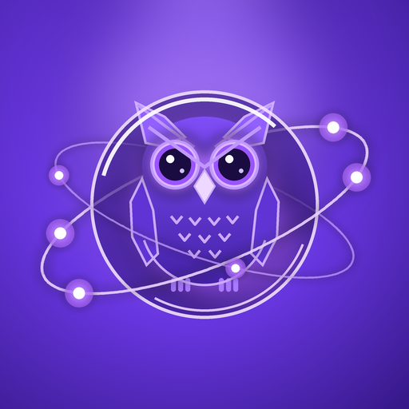
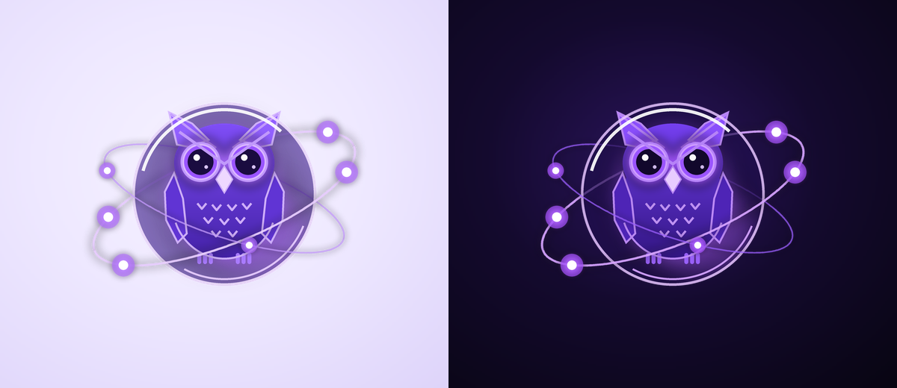

# Mimir

<p align="center">
  <picture>
    <source media="(prefers-color-scheme: dark)" srcset="docs/brand/icon-dark.png">
    
  </picture>
</p>

[](https://github.com/zxl1828/mimir-ios/actions/workflows/build-ipa.yml)
[](LICENSE)


本地优先、厂商中立的私人 AI 客户端，使用 SwiftUI + MVVM，最低支持 iOS 26。
用户填写自己的 API Key 与服务地址；Mimir 可读取兼容接口公开的模型目录，也允许手动输入模型 ID，并在会话中切换当前服务提供的模型。
界面以原生 Liquid Glass、幻光鸢尾紫和可切换的浅色 / 深色主题构建。

> **许可：MIT + Commons Clause** —— 可自由使用、修改、分发，但**不得倒卖**：
> 不得把本软件或其核心功能包装成收费产品、收费服务提供给第三方。
> 完整条款见 [LICENSE](LICENSE)。

## 主要能力

### 对话
- 流式输出（逐字渲染），支持随时停止、重新生成、引用、编辑重发、删除
- 任意一条回答都能重新生成并保留多个版本，`< 2/3 >` 左右切换对比；
  「从这里重新生成」会把后续内容收进分支，切回旧版本即可原样恢复
- 对话可导出为长图（浅色 / 深色两种样式），全程本机离屏渲染，
  支持保存到相册或直接分享
- Markdown 渲染：标题、列表、引用、代码块（可复制）、表格、`$$LaTeX$$` 公式、Mermaid 图表
- 多模型接入：OpenAI 兼容 Chat Completions 与 Anthropic Messages 协议；
  可接 OpenAI、DeepSeek、OpenRouter、Ollama、vLLM、LM Studio 等兼容服务，
  用户填写自己的 API Key、协议和 Base URL，读取 `/models` 目录，或手动输入模型 ID
- 会话中可切换当前服务商已解析或保存的模型；每个会话保留自己的模型选择
- 长对话滚动摘要，超出上下文窗口时自动压缩而不是粗暴截断
- Token 用量统计（消息级与本机累计）

### 交互
- **Agent Dock**：输入框上方的智能体胶囊，切换当前对话的智能体上下文
- **技能系统**：输入 `/` 即时唤起技能选择浮层，支持键盘 ↑↓ / 回车 / Esc、
  关键词与端侧语义双层意图推荐、JSON 导入导出。内置 13 个技能：总结、翻译、
  润色、解释代码、写邮件、头脑风暴、做幻灯片、写文档、整理表格、画流程图、
  读长文、会议纪要、语音速记
- **全局搜索**：跨对话标题、正文、推理过程、智能体与技能的全文检索，命中高亮，
  点一下跳回原对话并定位到那条消息（快捷键可切换范围与时间筛选）
- **思考模式滑块**：快速 / 思考 / 专家 / Ultra 四档，冷 → 暖渐变轨道，
  Ultra 档带光晕扩散、呼吸脉冲、流光、粒子与标签扫光
- 侧边栏抽屉：会话记录（搜索 / 重命名 / 置顶 / 复制 / 删除）、智能体、技能、
  设置、记忆浏览器、MCP 服务器、数据流向

### 分享与自动化
- **导出长图**：把整段对话渲染成一张长图（浅色 / 深色 / 渐变三种样式），
  保存到相册或直接分享出去；渲染在本机完成，不上传
- **定时任务**：自定义「每天 / 每周几 几点」用指定智能体与技能自动生成内容，
  结果落成一段带日期的新对话；内置「每日简报」示例任务
- **录音纪要**：在语音模式里点一下按钮，就把这次语音对话整理成
  结论 / 待办 / 讨论要点 / 待澄清四段式纪要，写回同一个会话

### 语音（全部端侧）
- 能量 VAD 自动断句（可调阈值），静音 1.5 秒自动提交
- 端侧语音识别（系统 Speech 框架，强制离线）
- 朗读交给系统语音合成（AVSpeechSynthesizer），可在设置里挑系统音色
- 流式逐句合成播放，支持 Barge-in 打断
- `AVAudioSession` 同时录制与播放，处理中断与路由切换

### 记忆与隐私
- 端侧向量记忆：NLEmbedding + Accelerate 余弦相似度，索引常驻内存
- 记忆浏览器：查看、搜索、编辑、删除、时间线、来源溯源、命中标签跳转、JSON 导入导出
- 对话结束后后台自动提炼长期事实
- 数据流向面板：逐项说明哪些数据只在本机、哪些会发送到云端
- 记忆条目可标记「仅本地使用」，标记后不会随对话发送
- 可设置本地用户名和裁剪头像；头像文件保存在受 iOS 文件保护的数据目录
- 可开启 Face ID / Touch ID 应用锁，冷启动及从后台返回时重新验证

### 扩展
- **MCP**：官方 `modelcontextprotocol/swift-sdk`，支持 HTTP/SSE 多服务器并行连接、
  工具目录、调用实时进度、按服务器授权「数据可上传」
- **系统工具**：OCR 文字识别、条码/二维码识别、Spotlight 检索，全部本机执行
- **多模态**：相册、拍照、文档扫描（VisionKit），本地先做 OCR/条码预处理再提问
- **App Intents**：总结、翻译、润色、解释代码、写邮件，已暴露给 Siri 与 Shortcuts
- **Live Activity**：锁屏与灵动岛显示生成状态、预览与 token 数
- **后台任务**：BGTaskScheduler 注册的后台刷新与每日简报

## 技术栈

| 项目 | 说明 |
|---|---|
| 语言 | Swift 6（严格并发检查） |
| UI | SwiftUI、SF Symbols、原生 Liquid Glass（`glassEffect`）与动态鸢尾紫光效 |
| 持久化 | SwiftData |
| 凭据 | Keychain（API Key 与 MCP Token 均不入 UserDefaults） |
| 网络 | 自建统一网络层（SSE 流式解析，OpenAI 兼容 + Anthropic 双协议） |
| 依赖 | `modelcontextprotocol/swift-sdk`（MCP） |
| 工程生成 | XcodeGen（`Project.yml`） |

## 构建

推送到 `main` 分支即触发 GitHub Actions 构建，产出**未签名** IPA：

```
https://github.com/zxl1828/mimir-ios/actions
```

构建流程：选择 Xcode 26 → 下载语音模型（约 99MB，打包进 App）→
`xcodegen generate` → `xcodebuild`（关闭代码签名）→ 打包 `Payload` 为 IPA。

本地构建（需要 macOS + Xcode 26）：

```bash
bash scripts/fetch-voice-models.sh
xcodegen generate
xcodebuild -project Mimir.xcodeproj -scheme Mimir \
  -configuration Release -sdk iphoneos -destination 'generic/platform=iOS' \
  CODE_SIGNING_ALLOWED=NO build
```

## 安装

产物是未签名 IPA，需要用自签工具安装（AltStore、Sideloadly、TrollStore 等），
或使用自己的开发者证书重签后安装。

## 数据边界

**只在本机完成**：语音识别与合成、向量嵌入与检索、记忆存储与导出、
意图识别与技能推荐、OCR / 条码 / Spotlight、端侧回复建议。

**会发送到云端**：对话文本、你附加的图片、非「仅本地」的记忆片段、
以及你为该服务器显式授权「数据可上传」后的 MCP 工具返回值。

Code 页的远程 Xcode 构建只使用用户本人绑定的 GitHub 账号和仓库。用户确认构建后，所选项目会上传到该仓库的临时分支并触发 Actions；公开仓库会在构建期间公开这些源码，任务结束后临时分支自动删除。

## 已知限制

- MCP 的 `ui://` 交互式表单（MCP Apps）尚未渲染为原生表单
- MCP OAuth 授权流程尚未接入，目前使用手动填写访问令牌
- 「任务模式」（先在对话中列任务清单再逐步执行）尚未实现
- 自动模型发现要求服务端提供兼容的 `/models` 列表；聊天请求要求 OpenAI 兼容 Chat Completions 或 Anthropic Messages。其他原生协议需通过兼容网关接入；不提供模型列表的服务可手动填写模型 ID
- Mermaid 与 KaTeX 渲染依赖 WebView 加载 CDN，离线时回退显示源码
- stdio 传输的 MCP 服务器在 iOS 上不可用（系统不允许派生子进程），仅支持 HTTP/SSE

## 品牌

吉祥物是悬浮在全息液态玻璃球中的 **Mimir Cyber-Owl**：用 `Canvas` 矢量绘制
（`Mimir/Views/Components/MimirMascot.swift`，设计稿 100 × 100，与 App 图标同源几何），
带双同心倾斜星轨逆向旋转、2.2s 呼吸光晕与眨眼动画，并按场景切换三档情绪 ——
`.calm` 空对话页 / `.thinking` 生成中（星轨加速 + 思考星尘）/ `.happy` 引导页连接成功（月牙笑眼 + 四角星闪光）。

App 图标在 `Mimir/Resources/Assets.xcassets/AppIcon.appiconset`，
含浅色 / 深色 / 着色（tinted）三套 1024×1024 资源；
改色改形后重跑 `python tools/icon/generate_icon.py` 即可重新生成，无需设计稿。

<p align="center">
  
</p>

## 许可

本项目以 **MIT + Commons Clause** 发布，完整条款见 [LICENSE](LICENSE)。

- 可以自由使用、修改、分发，包括个人项目、学习研究与公司内部使用
- 二次开发后可以按同样条款开源发布
- **不得出售本软件**，也不得把本软件或其核心功能包装成收费产品、收费服务提供给第三方（例如付费上架应用商店、作为付费托管服务提供、收取授权费）

这是一份「源码公开（source-available）」许可，而非 OSI 定义的开源许可 —— 因为
OSI 开源定义不允许限制商业使用。除「不得倒卖」这一条外，其余自由与 MIT 完全一致。

随 App 打包的第三方组件与模型见 [THIRD_PARTY_NOTICES.md](THIRD_PARTY_NOTICES.md)，
它们仍遵循各自的原始许可，不受本附加条款影响。

参与贡献请阅读 [CONTRIBUTING.md](CONTRIBUTING.md)；安全问题请按
[SECURITY.md](SECURITY.md) 私下报告。

## English

Mimir is a local-first, provider-neutral AI client for iOS 26. Connect your own API key and endpoint using OpenAI-compatible Chat Completions or Anthropic Messages, discover models when the server exposes a compatible `/models` endpoint, or enter a model ID manually. Compatible hosted and self-hosted services include OpenAI, DeepSeek, OpenRouter, Ollama, vLLM and LM Studio. Each conversation can switch among models available from the configured endpoint. Native APIs that use a different protocol need a compatible gateway. Mimir also includes native Liquid Glass, on-device voice and memory, skills, MCP tools, and App Intents.

Remote Xcode builds use only the GitHub account and repository that the user binds. After confirmation, the selected project is uploaded to a temporary branch in that repository and built with Actions. Source files are public during the build when the chosen repository is public; the temporary branch is deleted after the run.

Build with Xcode 26 + [XcodeGen](https://github.com/yonaskolb/XcodeGen):

```bash
bash scripts/fetch-voice-models.sh
xcodegen generate
xcodebuild -project Mimir.xcodeproj -scheme Mimir \
  -configuration Release -sdk iphoneos -destination 'generic/platform=iOS' \
  CODE_SIGNING_ALLOWED=NO build
```

CI produces an unsigned IPA on every push to `main`. Licensed under MIT with Commons Clause (source-available; reselling is not permitted) —
see [CONTRIBUTING.md](CONTRIBUTING.md) and [SECURITY.md](SECURITY.md).
